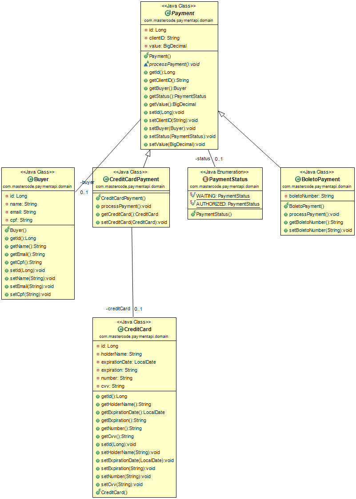

# Payment-api challenge

## Entity mapping


## Getting started

### Prerequisites
- Java 1.8+
- Eclipse & Embedded Maven

### Importing project on Eclipse
- clone the Git repository.
- Open Eclipse
- File -> Import -> Existing Maven Project -> Locate project folder location -> Check Pom.xml file -> Finish

### Setup local mysql database
At application.properties file insert DB user name and password
```
spring.datasource.url=jdbc:mysql://localhost/payment_api
spring.datasource.username=
spring.datasource.password=
```

### Running project
- Choose the Spring Boot Application file PaymentapiApplication.java
- Right Click on the file and Run as Java Application

## Built With
* [Eclipse](https://www.eclipse.org/) - IDE
* [Maven](https://maven.apache.org/) - Dependency Management
* [Spring](https://spring.io/) - Spring framework, JPA, Boot
* [Lombok Project](https://projectlombok.org/setup/eclipse) - Getters and Setters generator
